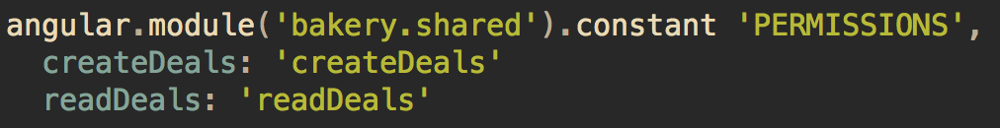

autoscale: true
footer: © Sharethrough, November 11 2015
slidenumbers: false

# Angular Patterns

^ Thank you all for attending
- hoping we can do something like this pretty frequently

---

# Conversion Overview

- Renaming files
- Converting templates
- Fetching data from Rails API
- Creating API controllers
- Front-end routing
- Front-end permissions

^ Here are a few things we're gonna go over
- Some in more detail than others, you can always check out my PR for more detail
- or just ask me after this

---

# Renaming[^1]

`deals/deals_index_controller.js.coffee`
_becomes_
`deals/index.controller.js.coffee`

`deals/api_service.js.coffee`
_becomes_
`deals/data_service.js.coffee`

^ doesn't necessarily have to be index/show, etc.
- just name it after what it's for/ what it does

[^1]: [https://github.com/johnpapa/angular-styleguide#naming](https://github.com/johnpapa/angular-styleguide#naming)

---

# Renaming

^ as you can see, some were already correct, others not
- data_service vs api.data_service?
- now lets go over converting the actual templates (next)

---

# Template Conversion

^ Notice a few things
- ugly bracket syntax
- can can usage in markup
- in-line rails for model data (mix with angular too)
- javascript block for bootstrapping data
- render partial syntax
- random double quotes
- hrefs
- and here's where I ended up (next)

---

# Template Conversion

^ more readable attributes using parentheses
- all single quotes unless otherwise needed
- no ng-controller declaration (will address later)
- ui-sref instead of href
- if-can directive
- ng-bind over mustaches
- all rails data lives on controller
- ng-include over render partial (will go over more)
- no more :javascript
- here's how we get data instead (next)

---

# Getting Rails Data

^ inject deals data service
- make call, resolve promise and set to instance variable
- what if you need deal before page loads? (We'll get to that later)
- and heres the data service (next)

---

# Getting Rails Data

^ super simple data service
- could live in bakery.shared, but for now leave here (due to future changes)
- call api endpoint with url with key
- and heres the api controller (next)

---

# Getting Rails Data

^ very simple
- includes is for rendering seat name without n+1 queries
- and here are some of those routes that we needed to create
- authorize resource for ensuring user can see deal

---

# Getting Rails Data

^ Nothing too crazy here
- api internal controller
- globbing for angular routing
- Home controller index action is blank

---

# ifCan Directive

The frankenstein if-else:

^ would love to hear if someone knows a better way to do this

---

# Angular Partials

In `deals/index.nghaml`:

In `deals/bar_table.nghaml`:

^ specify the source (directory, name)
- set internal controller if it is shared in onLoad
- partial now has access to dealsCtrl through metricsCtrl
- lets talk about maybe using ui-view in the future?

---

# Angular Partials

In case wrapping the partial causes issues:

^ This is for things that have css like div > .foo
- you can use this directive everywhere else too

---

# Angular Routing[^2]

[^2]: [https://github.com/angular-ui/ui-router](https://github.com/angular-ui/ui-router)

^ - remember when I got rid of ng-controller? It's here
- lets focus on deals state first
- url, template, controller, as
- parent
- parent state
- ui-view template
- data permissions (will go over this in a minute)
- lets jump back to front-end permissions

---

# Angular Routing

New and Show routes:

^ two different state routes
- one with no params, the other with a required dealkey param
- both Will trigger state changes, change URL, not reload browser
- you can also pass arbitrary params to routes and handle them on a case-by-case basis
- now lets go over permissions (next)

---

# Angular Routing

##in `deals/router.js.coffee`:

##in `shared/permissions.constant.js.coffee`:

^ So, remember that data-permission hash?
- Make sure you have all permissions in the constant file
- if you don't, don't worry, you'll be reminded (next)

---

# Angular Routing

^ Auth will fail, and you'll get this console error message
- Now lets get into some small implementation details about permissions

---

# Angular Routing

 

^ Heres the basic method that does 90% of the work
- There's a lot of technical details that you're interested
- checks against manage first, since that encompasses all actions of a feature/resource
- maybe feature is the wrong variable name here
- but basically it ends up here, checking against the users cancan abilities
- you can also do custom checking like this (next)

---

# Angular Routing

 

^ This is part of a switch statement in the main canAccess method
- See here you can use that can method, or do something custom
- you can modify this file and allow custom attributes or something other than key potentially
- checking role or pub key to only allow user to see their own pub content
- and here is where the permission service gets called (next)

---

# Route Authorization

^ lots of stuff here again, but it's not super important to understand
- check if logged in, unless state is login (doesn't exist yet)
- basically the parent publisher stuff might be important
- if there is a parent you must be able to see parent
- make sure you can also access curent
- if unauthorized, go to a pseudo 404 page
- prevent default if you are not logged in
- get current user (pseudo log in)
- set user in session, recurse
- one last thing I'd like to mention

---

# Router Resolving

^ Router resolving is a very cool concept
- It takes code from this:

---

# Router Resolving

^ ...to this

---

# Router Resolving

^ ...and this
- Use route resolves for data that is required before the page loads
- prevents things like stuff showing up then snapping around once data is loaded
- will cause initial page load to take longer so...
- we need to establish a pattern showing that the page is loading
- but it also gets rid of lots of prepareData calls and jittery pages

---

# Gotchas and Interestings

Coffeescript + Inline-Edit:

^ returning promise made the http request twice

---

# Gotchas and Interestings

Boostrap Modals

^ result callback when modal.close called
- resolve data into it, without using extra unneeded service
- added benefit of it being obvious that the modal needs these values (breaks if not present)

---

# Gotchas and Interestings

Boostrap Modals

^ placements and dealKey *must* be resolved into it, even if it is just null

---

# Gotchas and Interestings

Camelizing and Decamelizing $http requests

^ This is something I'd like to implement sometime soon
- will require another large branch probably :\

---

# Further Discussion

- Coffeescript: CS classes vs VM syntax?
- str-directive-name?
- Plan for separating front-end from back-end
- Better handling duplication like metrics-related stuff
- auto-camelize and decamelize http requests
- relying on cancan abilities JSON
- plan for future refactor?

---

# References

[John Papa's Styleguide](https://github.com/johnpapa/angular-styleguide)

[AngularUI Router](https://github.com/angular-ui/ui-router)

[Angular Devise](https://github.com/cloudspace/angular_devise)

[Pull Request](https://github.com/sharethrough/bakery/pull/1018)

---

